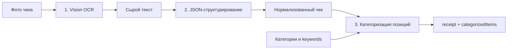
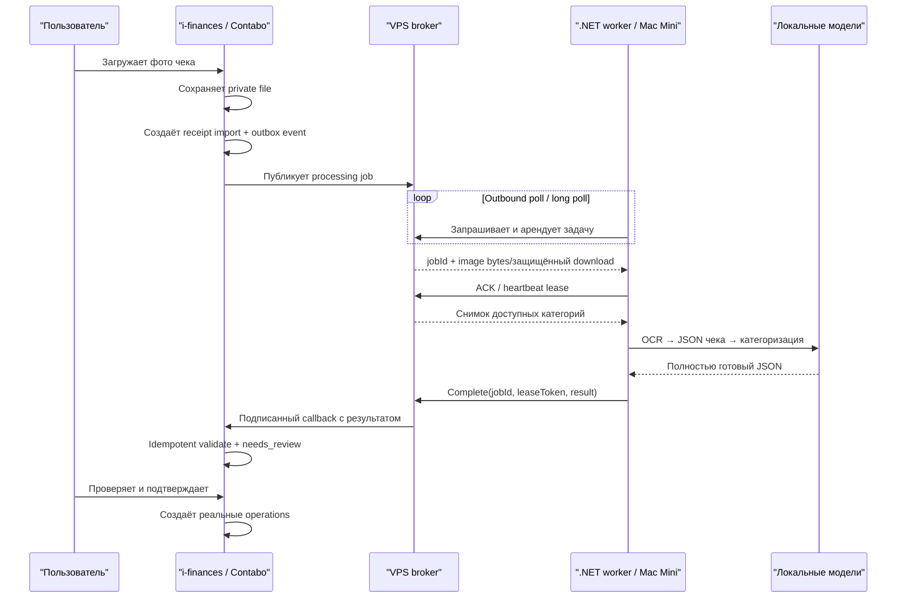

# Контекст OCR-прототипа и решения для миграции импорта чеков

## Статус документа

- Дата фиксации: 2026-07-29.
- Последнее архитектурное решение: 2026-07-29, локальный .NET worker на
  Apple Mac Mini через VPS broker.
- Источник: Codex-диалог `019f93da-915d-7151-ab6d-1d74fd8d3740`.
- Исходный прототип: `/Users/stark/Documents/web/experimental/ocr-receipt`.
- Целевой проект: `/Users/stark/Documents/web/experimental/i-finances`.
- Связанный документ: [receipt-photo-import-plan.md](./receipt-photo-import-plan.md).

Этот файл фиксирует контекст, решения и результаты экспериментов из диалога.
Он дополняет существующий план реализации: план описывает целевой продуктовый
процесс с черновиком и review, а этот документ — проверенный OCR-пайплайн,
контракты прототипа, стоимость, проблемы категоризации и ограничения переноса.

Прямой вызов OpenRouter/LM Studio из `i-finances`, описанный ниже, теперь является
историей прототипа, а не целевой production-архитектурой. Принято решение вынести
всю нейросетевую обработку на локальный .NET-сервис на Apple Mac Mini.

Секреты намеренно не приводятся. OpenRouter API key был опубликован в исходном
диалоге и записан в `.env.local` прототипа. Перед переносом или production-запуском
его необходимо отозвать и выпустить новый.

## Краткий итог

В отдельном CLI-прототипе реализован и проверен трехэтапный процесс:



Последняя конфигурация прототипа:

| Этап | Provider | Модель |
|---|---|---|
| OCR | OpenRouter | `qwen/qwen3-vl-32b-instruct` |
| JSON | OpenRouter | `nvidia/nemotron-3-ultra-550b-a55b` |
| Категоризация | OpenRouter | `mistralai/mistral-small-24b-instruct-2501` |

Локальный fallback через LM Studio сохранён:

| Этап | Модель |
|---|---|
| OCR | `allenai/olmocr-2-7b` |
| JSON/категоризация | `openai/gpt-oss-20b` |

На одном реальном чеке после оптимизации был получен расход
`$0.006227736` на чек, или `$3.113868` на 500 аналогичных чеков. Это один
замер, а не гарантированный production-бюджет. После оптимизации около 88% цены
приходилось на JSON-этап.

Эти модели и цены сохраняются как benchmark. Целевой production pipeline будет
исполняться локальными моделями на Mac Mini и не должен зависеть от OpenRouter.

Главный вывод для миграции: не переносить CLI как готовый production-модуль и
не переносить model clients внутрь `i-finances`.
Следует перенести проверенные идеи — provider abstraction, поэтапную диагностику,
компактный индексный контракт категоризации, сохранение оригинальных items и
usage accounting — но заменить слабые контракты прототипа на доменные схемы,
minor units, persistence, асинхронный job protocol и обязательный review.

## Принятое целевое решение: .NET worker через VPS broker

### Компоненты

1. `i-finances` работает на Contabo, принимает фотографию чека, сохраняет файл и
   создаёт бизнес-черновик импорта.
2. Публично доступный broker на VPS принимает задания и хранит состояние
   доставки.
3. Локальный .NET worker друга работает на Apple Mac Mini рядом с локальными
   моделями.
4. Worker делает только исходящие HTTPS-запросы к broker. Белый IP, проброс
   портов и входящее соединение к Mac Mini не нужны.
5. После обработки worker отправляет broker versioned JSON результата. Broker
   доставляет его обратно в `i-finances`.



### Критичная граница: receipt import, а не operation

При загрузке фото нельзя заранее создавать реальную операцию ledger и отдавать
её ID worker-у для произвольного обновления. На этом этапе ещё неизвестны
продавец, дата, сумма, категории и даже успешность распознавания.

Безопасная связь:

```text
receiptImportId → processingJobId → OCR result → review → operationIds
```

Worker оперирует только `processingJobId` и `receiptImportId`. Реальные
`operationIds` появляются после server-side validation и явного подтверждения
пользователя. Если UI нужен «черновик транзакции», это должна быть отдельная
draft-сущность, не влияющая на баланс и аналитику.

### Где хранятся основные данные и как не потерять задание

- База `i-finances` хранит сам чек, его владельца, результат проверки и созданные
  операции. Это главная версия данных.
- Broker хранит только очередь заданий, временную бронь задания за worker-ом и
  полученный от него результат.
- Локальная машина не получает прямого доступа к БД `i-finances`.
- Создание записи чека и записи в таблице исходящих сообщений должно происходить
  одной транзакцией БД.
- Фоновый отправитель читает таблицу исходящих сообщений, передаёт задания в
  broker и повторяет отправку при сетевой ошибке.
- Успешная отправка означает только то, что broker получил задание. Сам чек ещё
  не обработан.

Эту таблицу исходящих сообщений обычно называют `transactional outbox`. Она
нужна, чтобы не возникла ситуация: запись чека уже появилась, но приложение
перезапустилось за секунду до отправки задания и чек навсегда остался без
обработки.

### Повторная доставка без дублей

Сеть иногда обрывается в момент ответа, поэтому одно и то же задание или результат
может прийти повторно:

- broker может повторно выдать задачу после истечения lease;
- worker может повторно отправить completion после сетевого timeout;
- callback может прийти в `i-finances` больше одного раза;
- повторный запрос с тем же `processingJobId` не должен создавать дубль;
- повторный completion с тем же result hash возвращает успех;
- completion с другим результатом после финализации требует отдельной retry
  attempt/version, а не тихой перезаписи.

Простой «получил задачу и сразу удалил её из очереди» недопустим. Нужна временная
бронь задания за worker-ом:

1. worker забирает задачу на ограниченное время;
2. broker помечает её как занятую;
3. worker периодически сообщает: «я жив и всё ещё обрабатываю этот чек»;
4. после `complete` задача финализируется;
5. если Mac Mini выключился, время брони истекает и задача снова становится
   доступной;
6. после лимита неудачных попыток задача получает статус ошибки и требует
   внимания.

### Polling

Интервал 20–120 секунд допустим для первого эксперимента, но случайный polling
даёт непредсказуемую задержку и лишние запросы. Предпочтительный протокол:

- long polling на 20–30 секунд;
- немедленный ответ, когда появилась задача;
- `204 No Content`, если за окно задача не появилась;
- небольшой jitter перед следующим запросом;
- exponential backoff до 120 секунд при ошибках broker;
- отдельный heartbeat во время долгой обработки.

Если long polling пока не реализуется, MVP может опрашивать broker через
фиксированные 20–30 секунд с jitter. Интервал 120 секунд следует использовать
как backoff при ошибках, а не нормальную задержку получения задач.

### Где хранится изображение и как worker его получает

Принятое решение:

1. Фото хранится на сервере `i-finances` внутри каталога `static/receipts`.
2. В production этот каталог подключается в контейнер как отдельный постоянный
   том, поэтому изображения не пропадают при пересборке приложения.
3. В БД хранится не само изображение и не публичная ссылка, а сгенерированный
   сервером адрес файла внутри хранилища.
4. Когда worker запрашивает конкретный чек, защищённый endpoint проверяет
   API-ключ и отдаёт содержимое файла как массив байтов.
5. Nginx может эффективно читать файл с тома, но чек не должен быть доступен по
   обычному публичному URL без проверки доступа.

Предпочтительный MVP-контракт:

```text
POST /v1/worker/jobs/lease
GET  /v1/worker/jobs/{jobId}/image
POST /v1/worker/jobs/{jobId}/heartbeat
POST /v1/worker/jobs/{jobId}/complete
POST /v1/worker/jobs/{jobId}/fail
```

`GET .../image` возвращает исходные байты с проверенными `Content-Type`,
`Content-Length` и `Content-SHA256`. Broker хранит адрес и служебные данные, но
не обязан хранить вторую копию изображения.

- прямой публичный доступ Nginx к `static/receipts` закрыт;
- в БД хранится opaque storage key, а не доверенный пользовательский путь;
- имя файла генерируется сервером и не берётся из upload filename;
- запись завершается атомарно до создания outbox event;
- download endpoint проверяет job, token, срок действия и content hash;
- после создания операций чек получает отдельный статус;
- фоновая очистка удаляет файл спустя настроенное количество дней после этого
  статуса, а не сразу после получения результата.

### Минимальные контракты

Публикация задания из `i-finances`:

```ts
type CreateReceiptProcessingJob = {
    callbackUrl: string;
    categories: Array<{
        id: string;
        keywords: string[];
        name: string;
    }>;
    categoriesSnapshotVersion: string;
    image: {
        contentSha256: string;
        contentType: 'image/jpeg' | 'image/png' | 'image/heic';
        downloadToken: string;
        sizeBytes: number;
    };
    processingJobId: string;
    receiptImportId: string;
    requestedPipelineVersion: string;
    schemaVersion: 1;
};
```

Lease worker-у:

```ts
type LeasedReceiptProcessingJob = {
    attempt: number;
    categories: Array<{
        id: string;
        keywords: string[];
        name: string;
    }>;
    categoriesSnapshotVersion: string;
    imageDownloadUrl: string;
    leaseExpiresAt: string;
    leaseToken: string;
    processingJobId: string;
    receiptImportId: string;
    requestedPipelineVersion: string;
    schemaVersion: 1;
};
```

Completion:

```ts
type CompleteReceiptProcessingJob = {
    leaseToken: string;
    processingJobId: string;
    processor: {
        finishedAt: string;
        modelVersions: string[];
        pipelineVersion: string;
        startedAt: string;
        workerId: string;
    };
    result: unknown;
    resultSha256: string;
    schemaVersion: 1;
};
```

`result: unknown` не означает, что worker может вернуть произвольный результат.
Это только защитная запись на стороне принимающего HTTP endpoint: данные из сети
сначала считаются непроверенными. Затем `i-finances` обязан проверить полностью
готовый JSON по Zod-схеме нужной версии. Если структура или суммы неверны,
результат не принимается.

### Статусы

Не следует смешивать бизнес-статус receipt import и транспортный статус broker.

Receipt import в `i-finances`:

```text
uploaded
→ queued
→ processing
→ needs_review
→ approved | rejected
```

Дополнительные terminal/retry состояния: `failed`, `cancelled`.

Processing job в `i-finances` и broker:

```text
pending_publish
→ queued
→ leased
→ processing
→ completed | retry_wait | failed | dead_letter | cancelled
```

Один receipt import может иметь несколько processing attempts, но только один
актуальный принятый результат.

### Результат worker-а

Worker получает снимок всех доступных категорий конкретной семьи: `id`, название
и ключевые слова. Это не постоянная копия справочника на Mac Mini, а данные,
актуальные в момент создания задания. Так результат можно воспроизвести, даже
если категории позднее изменятся.

Worker выполняет ровно три этапа:

1. локальная vision-модель извлекает из изображения сырой текст;
2. локальная text-модель превращает текст в структурированный JSON чека;
3. локальная модель распределяет все товарные строки по переданным категориям.

Одноэтапный вариант больше не рассматривается. На локальном железе экономия
одного вызова не является главной целью, а три отдельных этапа проще проверять и
повторять при ошибке.

Worker возвращает полностью готовый JSON для экрана проверки, а не команду
«обновить транзакцию». Минимум:

- `schemaVersion`;
- распознанный receipt;
- полный список `categorizedItems` с `categoryId`;
- raw OCR text или ссылка/флаг его наличия;
- pipeline/model versions;
- время обработки;
- warnings;
- confidence по ключевым полям, если pipeline умеет его считать.

`i-finances` проверяет, что каждый `categoryId` действительно был в переданном
снимке категорий, показывает результат пользователю и только после подтверждения
разбивает чек на нужное количество операций по категориям.

### Авторизация и защита соединения

- только HTTPS;
- `i-finances` генерирует отдельный длинный случайный API-ключ для интеграции;
- broker и worker передают его в заголовке `Authorization: Bearer ...`;
- ключ можно отозвать и заменить без изменения пользовательских паролей;
- signed/HMAC callback от broker к `i-finances`;
- lease token привязан к worker, job и attempt;
- private image download token короткоживущий и одноразовый;
- allowlist MIME, ограничение bytes и безопасное декодирование изображения;
- проверка SHA-256 до обработки;
- allowlist origin для callback и image source, защита broker от SSRF;
- запрет логирования image bytes, download token, lease token и полного OCR
  результата в обычные application logs;
- secrets с rotation и возможностью отозвать конкретный worker;
- audit событий publish, lease, heartbeat, complete, fail и callback.

API-ключ отвечает на вопрос «кому разрешено обращаться к сервису», но не
шифрует соединение. При обычном HTTP человек между Mac Mini и VPS сможет
перехватить и сам ключ, и фотографию чека. Поэтому HTTP допустим только внутри
изолированной локальной сети или VPN; через публичный интернет используется
HTTPS.

### Короткий словарь

- `worker` — программа на Mac Mini, которая обрабатывает чек;
- `broker` — сервис-посредник на VPS;
- `job` — задание на обработку одного чека;
- `lease` — временная бронь задания за конкретным worker-ом;
- `heartbeat` — короткое сообщение «я всё ещё работаю»;
- `callback` — запрос, которым broker сам возвращает результат в `i-finances`;
- `idempotent` — повторный одинаковый запрос не создаёт второй результат или
  вторые операции;
- `result hash` — контрольная сумма результата, по которой можно понять, что два
  ответа полностью совпадают;
- `long polling` — worker держит запрос открытым несколько секунд и сразу
  получает появившееся задание;
- `negative rules` — правила-исключения: слова или условия, при которых товар
  нельзя относить к определённой категории.

## Как развивалось решение

### 1. Одноэтапный OpenAI CLI

Первоначальная задача:

- `bun`/TypeScript CLI;
- запуск через `bun run scan` и, по возможности, `node scan.ts`;
- абсолютный путь к изображению;
- prompt из Markdown-файла;
- модель и API key в env;
- `gpt-4o-mini`;
- классовая архитектура, SOLID/KISS/DRY;
- русский JSDoc для классов, функций и типов.

Был создан минимальный проект с отдельными слоями config, IO, OpenAI adapter и
application orchestration. Для совместимости с Node 24 код перевели с `Bun.file`
на `node:fs/promises`, а TypeScript parameter properties — на явные поля.

### 2. Локальный двухэтапный LM Studio pipeline

После локального эксперимента одноэтапная схема была заменена на:

1. `allenai/olmocr-2-7b` извлекает сырой текст;
2. `openai/gpt-oss-20b` превращает текст в JSON.

OpenAI SDK удалили. Были введены:

- `HttpLmStudioChatClient`;
- отдельные OCR и JSON prompt-файлы;
- stage-specific модели и настройки;
- нормализация JSON-ответа модели;
- вывод только финального pretty JSON в stdout.

Обнаруженная и исправленная несовместимость LM Studio: multimodal `input`
принимает элементы с discriminator `type: "text"` и `type: "image"`.
Изначальный `type: "message"` приводил к HTTP 400.

### 3. Третий этап — группировка items по категориям

После появления `GET /api/public/categories` добавили:

- загрузку массива `{ color, description, id, keywords, name }`;
- отдельную модель и prompt категоризации;
- группировку полного массива receipt items по категориям;
- локальную fallback-категорию `{ id: null, name: "Без категории" }`;
- сохранение оригинальных item-объектов.

Модель возвращает индексы, а не переписывает товары. Это защищает распознанные
данные от изменений на третьем этапе.

Изначально предлагался fallback `Прочие траты`, но пользователь отменил это
решение в пользу `Без категории`. В прототипе категория с именем
`Прочие траты` скрывается от модели и также заменяется на `Без категории`, если
модель всё же её вернула.

### 4. Provider-neutral слой и OpenRouter

Общие LM Studio-типы были заменены на provider-neutral контракты:

- `ChatClient`;
- `ChatRequest`;
- `ChatResult`;
- независимый provider для каждого этапа.

Добавили `HttpOpenRouterChatClient` для
`POST /api/v1/chat/completions`. Один и тот же pipeline может направлять OCR,
JSON и категоризацию разным provider-клиентам.

`nvidia/nemotron-3-ultra-550b-a55b` оказался text-only, поэтому его нельзя было
использовать для прямого OCR изображения. Сначала OCR перевели на бесплатную
vision-модель `nvidia/nemotron-nano-12b-v2-vl:free`, затем ради качества —
на `qwen/qwen3-vl-32b-instruct`.

При проверке env был исправлен важный дефект: provider-specific переменная,
например `LM_STUDIO_JSON_MODEL`, не должна влиять на этап с
`JSON_PROVIDER=openrouter`. Общая `JSON_MODEL` остаётся явным override, а иначе
используется настройка только выбранного provider.

### 5. Usage accounting и оптимизация категоризации

CLI получил флаг:

```bash
bun run scan "/absolute/path/to/receipt.jpg" --usage-report
```

- итоговый JSON остаётся в stdout;
- токены и стоимость по этапам печатаются в stderr;
- учитываются input, output, total, reasoning, cached, cache-write tokens и cost.

Затем третий этап был удешевлён:

- тяжелая text-модель заменена на
  `mistralai/mistral-small-24b-instruct-2501`;
- из payload удалены UUID и полные item-объекты;
- модели передаются только item names и компактные индексы;
- сохранена обратная совместимость с прежним ответом `{ id, name }`.

## Фактическое состояние прототипа

### Точки входа и основные файлы

| Файл в `ocr-receipt` | Ответственность |
|---|---|
| `scan.ts` | CLI entry point |
| `src/app.ts` | composition root и orchestration |
| `src/config.ts` | `.env`/`.env.local`, provider и model resolution |
| `src/io.ts` | CLI args, prompts, image data URL, stdout/stderr |
| `src/lm-studio-client.ts` | LM Studio adapter |
| `src/openrouter-client.ts` | OpenRouter adapter и usage parsing |
| `src/categories-client.ts` | HTTP repository категорий |
| `src/receipt-pipeline.ts` | OCR → JSON → categorization |
| `src/types.ts` | общие интерфейсы |
| `raw-text.prompt.md` | prompt точного OCR |
| `pretty-json.prompt.md` | prompt структуры чека |
| `categorize-items.prompt.md` | prompt индексной категоризации |

В `package.json` нет runtime-зависимостей. Используются TypeScript 7 и Node
types; штатный runtime — Bun, поддержан Node 24.

### CLI-контракт

```bash
bun run scan "/absolute/path/to/receipt.jpg"
bun run scan "/absolute/path/to/receipt.jpg" --usage-report
node scan.ts "/absolute/path/to/receipt.jpg"
```

Изображение кодируется как base64 data URL. Поддерживаются как минимум типичные
JPEG/PNG-пути, валидируется существование обычного файла.

### Конфигурация

Основные переменные:

```env
OCR_PROVIDER=openrouter
JSON_PROVIDER=openrouter
CATEGORIZATION_PROVIDER=openrouter

OPENROUTER_API_KEY=...
OPENROUTER_BASE_URL=https://openrouter.ai
OPENROUTER_OCR_MODEL=qwen/qwen3-vl-32b-instruct
OPENROUTER_MODEL=nvidia/nemotron-3-ultra-550b-a55b
CATEGORIZATION_MODEL=mistralai/mistral-small-24b-instruct-2501

LM_STUDIO_BASE_URL=http://127.0.0.1:1234
LM_STUDIO_CHAT_PATH=/api/v1/chat
LM_STUDIO_OCR_MODEL=allenai/olmocr-2-7b
LM_STUDIO_TEXT_MODEL=openai/gpt-oss-20b

CATEGORIES_API_URL=http://localhost:5173/api/public/categories
OCR_PROMPT_FILE=raw-text.prompt.md
JSON_PROMPT_FILE=pretty-json.prompt.md
CATEGORIZATION_PROMPT_FILE=categorize-items.prompt.md
```

Разрешение модели должно работать так:

1. `<STAGE>_MODEL` — явный override;
2. provider-specific `<PROVIDER>_<STAGE>_MODEL`;
3. default выбранного provider.

В текущем `.env.example` прототипа есть дефект: `CATEGORIZATION_MODEL` объявлен
дважды, второй раз пустым. Этот файл нельзя переносить без очистки.

### Контракт OCR

OCR должен:

- максимально точно сохранить строки;
- не нормализовать и не интерпретировать;
- не удалять суммы, скидки, коды, УНП, дату и служебные поля;
- вернуть только plain text без Markdown и JSON.

Это важное разделение ответственности: исправление OCR-артефактов выполняется на
следующем этапе.

### Legacy-контракт JSON чека

Прототип просит модель вернуть:

```ts
type PrototypeReceipt = {
    date: string | null;
    items: Array<{
        discount: number | null;
        name: string;
        quantity: number | null;
        total: number | null;
        unitPrice: number | null;
    }>;
    merchant: string | null;
    total: number | null;
    unp: string | null;
};
```

Правила:

- дата — `YYYY-MM-DD`;
- УНП — строка из цифр;
- money — числа, не строки;
- скидка по позиции — отрицательное число;
- отсутствующие значения — `null`;
- служебные строки чека не становятся items;
- переносы одного товара объединяются;
- очевидные OCR-ошибки в названии можно исправлять без изменения смысла.

Это контракт prompt, но не строгий TypeScript/runtime-контракт: фактически
прототип использует `Record<string, unknown>` и обычный `JSON.parse`.

### Нормализация item total

Если у позиции отсутствует `total`, но есть `quantity` и `unitPrice`, прототип
вычисляет:

```text
total = roundToCents(quantity * unitPrice + (discount ?? 0))
```

Так как скидка хранится отрицательным числом, она уменьшает итог позиции.

### Контракт категорий

Прототип ожидает:

```ts
type FinanceCategory = {
    color?: string;
    description: string;
    id: string;
    keywords: string[];
    name: string;
};
```

В текущем `i-finances` endpoint уже реализован:

```http
GET /api/public/categories
```

Он:

- возвращает активные категории default household;
- не требует пользовательскую сессию;
- отвечает массивом `{ color, description, id, keywords, name }`;
- выставляет `access-control-allow-origin: *`;
- использует `cache-control: no-store`.

Для локального внешнего прототипа это рабочий контракт. После переноса pipeline
внутрь `i-finances` ходить к собственному публичному HTTP route не нужно:
категории должны читаться через repository/service с явным `householdId`.

### Компактный контракт категоризации

Вход:

```json
{
  "items": [
    { "index": 0, "name": "Паста зубная ..." }
  ],
  "categories": [
    {
      "index": 0,
      "name": "Гигиена",
      "description": "Средства личной гигиены для всей семьи",
      "keywords": ["зубная паста"]
    }
  ],
  "fallbackCategoryIndex": null
}
```

Ответ:

```json
{
  "categorizedItems": [
    {
      "categoryIndex": 0,
      "itemIndexes": [0]
    },
    {
      "categoryIndex": null,
      "itemIndexes": [1]
    }
  ]
}
```

Локальный builder:

- принимает только валидные индексы;
- игнорирует повторы;
- не разрешает одному item попасть в несколько групп;
- кладёт неупомянутые items в `Без категории`;
- маппит индексы обратно в реальные category ID и оригинальные item-объекты;
- для совместимости понимает старый ответ по category ID/name.

### Финальный legacy-вывод

```ts
type PrototypeResult = {
    receipt: PrototypeReceipt;
    categorizedItems: Array<{
        category: {
            id: string | null;
            name: string;
        };
        items: PrototypeReceipt['items'];
    }>;
};
```

Группы не содержат собственные суммы или проценты. Это было явным решением:
агрегации должен считать сервис финансов, а не OCR CLI.

## Подтверждённые продуктовые решения из диалога

Следующие пункты были явно выбраны пользователем:

- категория в результате содержит `id + name`;
- полный оригинальный item сохраняется;
- категоризация опирается только на `item.name`;
- keywords приходят массивом строк;
- отдельная модель категоризации задаётся отдельной env-переменной;
- отдельный prompt категоризации нужен;
- при неизвестной категории используется `Без категории`, не `Прочие траты`;
- если модель вернула несуществующую категорию, применяется fallback;
- отсутствующий item total можно вычислить из quantity, unit price и discount;
- скидка должна учитываться при вычислении суммы;
- финальный ответ содержит и `receipt`, и `categorizedItems`;
- групповые суммы и проценты в прототипе не нужны;
- промежуточную БД в CLI-прототипе создавать не нужно;
- полный объект нужен для последующей передачи в сервис финансов и создания
  операций после обработки.

Пользователь также подтвердил возможность использовать бесплатный OpenRouter OCR
endpoint, так как экспериментальные чеки не считались конфиденциальными. Это не
отменяет необходимость заново определить privacy policy для production.

## Реальные результаты и стоимость

Оба замера сделаны на одном фото чека `IMG_4860.jpg`. Поэтому цифры показывают
направление оптимизации, но не распределение по разным магазинам, качеству фото и
числу товарных строк.

### До оптимизации категоризации

| Этап | Input | Output | Total | Reasoning | Cost/check |
|---|---:|---:|---:|---:|---:|
| OCR | 2,780 | 852 | 3,632 | 0 | `$0.000643552` |
| JSON | 2,123 | 1,964 | 4,087 | 1,396 | `$0.0059874` |
| Categorization | 4,321 | 1,536 | 5,857 | 1,242 | `$0.0081222` |
| **Итого** | **9,224** | **4,352** | **13,576** | **2,638** | **`$0.014753152`** |

Экстраполяция на 500 похожих чеков:

- `$7.376576`;
- разумный тогдашний запас: `$8–9`;
- категоризация составляла около 55% стоимости.

### После дешёвой модели и компактного payload

| Этап | Input | Output | Total | Reasoning | Cost/check |
|---|---:|---:|---:|---:|---:|
| OCR | 2,780 | 851 | 3,631 | 0 | `$0.000643136` |
| JSON | 2,122 | 1,757 | 3,879 | 1,179 | `$0.00549` |
| Categorization | 1,780 | 70 | 1,850 | 0 | `$0.0000946` |
| **Итого** | **6,682** | **2,678** | **9,360** | **1,179** | **`$0.006227736`** |

Экстраполяция на 500 похожих чеков:

- OCR: `$0.321568`;
- JSON: `$2.745`;
- категоризация: `$0.0473`;
- итого: `$3.113868`;
- практический ориентир с небольшим запасом: `$3.2–3.5`.

Изменение относительно первого замера:

- общая стоимость: `-57.8%`;
- стоимость категоризации: `-98.8%`;
- input tokens: `-27.6%`;
- output tokens: `-38.5%`;
- total tokens: `-31.1%`;
- reasoning tokens: `-55.3%`.

После оптимизации JSON-этап даёт примерно 88% общей стоимости. Следующий рычаг
экономии — JSON extraction, а не OCR и не уже оптимизированная категоризация.

Цены моделей и availability меняются. Для production-планирования нужно хранить
фактический `usage.cost` по каждому запросу и пересчитывать бюджет по выборке
реальных чеков.

## Что показал тест качества

На одном чеке OCR и JSON-структурирование были вручную сверены пользователем и
оценены как совпадающие с чеком.

Категоризация выявила проблему не столько модели, сколько taxonomy:

- детское мыло сильная модель относила в
  `Дети / Развлечения / Игрушки`;
- дешёвая модель относила зубную пасту в `Здоровье`;
- детские салфетки и мыло могли попадать в `Домашнее хозяйство`;
- полоски для носа в одном прогоне попадали в `Красота`, в другом —
  в `Домашнее хозяйство`.

### Рекомендация из диалога, ещё не зафиксированная как реализованное решение

Создать отдельную категорию `Гигиена` и развести смыслы:

| Категория | Примеры |
|---|---|
| Гигиена | зубная паста, щётка, мыло, шампунь, салфетки, дезодорант |
| Красота | маски, косметические полоски, кремы |
| Домашнее хозяйство | средство для посуды, пакеты, губки, порошок, чистящие средства |
| Здоровье | лекарства, БАДы, медизделия, лечебные средства |
| Детские товары | подгузники, пелёнки, детское питание, игрушки |

Слово `детский` или `baby` не должно само по себе определять категорию.

### Предпочтительный matching

LLM не должен быть первым и единственным matcher:

1. exact/normalized positive keywords;
2. negative keywords или исключающие правила;
3. подтверждённая история категоризации похожих receipt items;
4. похожие существующие операции;
5. LLM только для неразобранных items;
6. `Без категории` при низкой уверенности.

В `i-finances` уже есть `findSuggestedCategory()`, который нормализует title и
ищет вхождение category keyword. Его можно использовать как первый слой, но
сейчас он:

- возвращает первое совпадение;
- не учитывает длину/специфичность keyword;
- не поддерживает отрицательные правила;
- не сообщает confidence или причину выбора.

Перед AI fallback matcher следует сделать детерминированным и объяснимым.

## Что стоит перенести

- provider-neutral интерфейс model client;
- раздельные модели и provider по этапам;
- отдельные prompt-файлы или версионируемые prompt templates;
- stage-aware ошибки с названием этапа и endpoint;
- компактный индексный payload категоризации;
- локальный маппинг ответа модели на реальные category IDs;
- сохранение оригинальных item-данных;
- fallback для пропущенных, повторных и невалидных индексов;
- usage accounting отдельно по этапам;
- вывод/логирование request model, provider, token usage и cost без секретов;
- golden fixtures из реальных чеков;
- возможность локального provider для разработки.

## Что нельзя переносить без переработки

### Слабый receipt-контракт

`Record<string, unknown>` и обычный `JSON.parse` недостаточны. В целевом проекте
нужна строгая Zod-схема и versioned domain contract.

### Денежные значения с плавающей точкой

Прототип использует `47.39`, `8.59`, `-0.04`. `i-finances` хранит money в minor
units, поэтому целевой контракт должен использовать целые значения:
`4739`, `859`, `-4`.

Нужно отдельно зафиксировать семантику `discountMinor`: отрицательная поправка,
как в прототипе, или положительный размер скидки. Нельзя смешивать оба варианта.

### Публичный categories endpoint как внутренняя зависимость

Публичный endpoint привязан к `DEFAULT_HOUSEHOLD_ID` и CORS `*`. Это подходит
внешнему локальному CLI, но не multi-household production pipeline.

После переезда категории должны загружаться по household текущего пользователя
через внутренний server API/repository. Публичный route затем следует либо
удалить, либо защитить отдельной политикой доступа.

### Свободный JSON вместо Structured Output

Удаление Markdown fences и попытка найти JSON внутри текста полезны как fallback,
но не должны быть основным production-контрактом. Предпочтителен JSON Schema /
structured output с последующей Zod-валидацией.

### Автоматическое создание операций

CLI выдаёт готовую группировку, но это не даёт права сразу менять ledger.
Целевой flow из связанного плана остаётся обязательным:

```text
upload → processing → needs_review → approved/rejected → operations
```

### Hardcoded fallback по имени

Фильтрация строки `Прочие траты` по имени хрупкая и зависит от локали. Если
подобная системная семантика нужна, она должна выражаться стабильным ID или
отдельным category kind.

### Конфигурационные и эксплуатационные пробелы

В прототипе нет production-ready:

- timeouts и retry policy;
- idempotency;
- rate-limit/backoff;
- cancellation;
- persistent job state;
- audit trail;
- confidence contract;
- prompt/model versioning в данных;
- дедупликации повторной загрузки одного фото;
- ограничения размера/формата изображения;
- политики хранения и удаления фото.

## Целевое сопоставление контрактов

| Прототип | Целевой `i-finances` |
|---|---|
| `merchant: string \| null` | `merchant.displayName`, `legalName`, `address`, `unp` |
| `date` | `happenedOn` |
| `total: number` | `totalAmountMinor: integer` |
| `unitPrice: number` | `unitPriceMinor: integer` |
| `discount: number` | `discountMinor: integer` с единой семантикой |
| `total: number` item | `totalMinor: integer` |
| `Record<string, unknown>` | versioned Zod schema |
| HTTP public categories | internal household-scoped repository/service |
| `{ category, items[] }` | persisted receipt items + suggested `categoryId` |
| stdout JSON | `receipt_imports` draft |
| ручной CLI retry | persisted status/error + retry command |
| `usage-report` stderr | structured telemetry per processing attempt |
| прямой model API call | versioned job через VPS broker |
| локальный CLI process | авторизованный .NET pull-worker на Mac Mini |
| image data URL | private binary download или short-lived signed URL |

Целевой минимальный parsed receipt уже описан в
[receipt-photo-import-plan.md](./receipt-photo-import-plan.md). Перед реализацией
его следует дополнить:

- `schemaVersion`;
- source confidence и/или confidence по полям;
- `rawText` как отдельное диагностическое поле или артефакт;
- model/provider/prompt version;
- явная семантика скидки;
- validation result с расхождением суммы строк и total.

## Рекомендуемая граница модулей после переезда

```text
src/entities/receipt-import/
    api/
    model/

src/server/receipt-import/
    receipt-processing-broker-client.ts
    receipt-processing-dispatcher.ts
    receipt-processing-result-handler.ts
    receipt-processing-outbox-repository.ts
    receipt-processing-job-repository.ts
    receipt-normalizer.ts
    receipt-validator.ts
    receipt-matcher.ts
    receipt-import-service.ts
    receipt-import-repository.ts

src/features/receipt-import/
src/views/receipts/
src/routes/(app)/receipts.tsx
src/routes/api/internal/receipt-processing-result.ts
```

Названия ориентировочные. Важны границы:

- `i-finances` не знает внутреннее устройство локальных моделей;
- broker client знает транспортный контракт, но не доменную валидацию receipt;
- result handler принимает `unknown`, проверяет schema/version/signature и только
  затем вызывает domain service;
- normalizer переводит данные в канонический domain contract и minor units;
- validator проверяет даты, валюту и суммы;
- matcher работает только с household-scoped данными;
- service управляет статусами, persistence и повторными попытками;
- создание operations выполняется отдельной командой только после approval.

Код локального .NET worker и broker живёт в отдельных сервисах/репозиториях.
Их OpenAPI/JSON Schema контракты должны версионироваться совместно с
`i-finances`, но model implementation не переносится в этот frontend/server repo.

## Рекомендуемый порядок миграции

### 0. Безопасность и фиксация baseline

- [ ] Отозвать OpenRouter key, опубликованный в диалоге.
- [ ] Не выпускать новый cloud-model key без отдельной необходимости: целевой
  pipeline работает на локальных моделях.
- [ ] Выпустить отдельные broker credentials для `i-finances` и Mac Mini worker.
- [ ] Сохранить 5–10 исходных фото, raw OCR, parsed JSON и ручную разметку как
  локальные закрытые fixtures.
- [ ] Зафиксировать текущие usage reports вместе с model IDs и датой.

### 1. Канонический контракт

- [ ] Утвердить Zod-схему parsed receipt.
- [ ] Перевести money в minor units.
- [ ] Утвердить знак `discountMinor`.
- [ ] Добавить schema version.
- [ ] Разделить model output и validated domain object.

### 2. Persistence и state machine

- [ ] Реализовать `receipt_imports`, `receipt_items` и связи с operations.
- [ ] Реализовать `receipt_processing_jobs` и processing attempts.
- [ ] Реализовать transactional outbox для публикации в broker.
- [ ] Добавить статусы из основного плана.
- [ ] Хранить worker, pipeline/model version, raw output, timings и error.
- [ ] Сделать повторную обработку идемпотентной.

### 3. Broker integration

- [ ] Совместно с .NET-разработчиком утвердить OpenAPI и JSON Schema v1.
- [ ] Реализовать publish job из outbox в broker.
- [ ] Реализовать private image download или short-lived signed URL.
- [ ] Реализовать подписанный callback broker → `i-finances`.
- [ ] Валидировать callback signature, timestamp, schema version и result hash.
- [ ] Применять callback идемпотентно по `processingJobId`.
- [ ] Настроить timeout, retry/backoff и dead-letter обработку.
- [ ] Не давать worker доступ к `i-finances` DB и operation commands.

Внутренняя схема локального model pipeline остаётся ответственностью .NET
worker-а. На общей fixture-выборке всё равно нужно сравнить:

- vision → structured receipt за один вызов;
- vision OCR → text structured receipt за два вызова.

### 4. Категоризация

- [ ] Доработать deterministic keyword matcher.
- [ ] Решить вопрос категории `Гигиена`.
- [ ] Ввести negative rules/anti-keywords или другой явный механизм исключений.
- [ ] Применять историю подтверждений до LLM.
- [ ] Отправлять в LLM только unresolved items.
- [ ] Сохранить компактный индексный контракт.
- [ ] Валидировать, что каждый item назначен не более чем одной категории.
- [ ] Низкую уверенность оставлять как `categoryId: null`.

### 5. Review и создание операций

- [ ] Показать распознанные поля, расхождение суммы и причины автоподбора.
- [ ] Разрешить исправлять items и категории.
- [ ] Создавать operations одной транзакционной командой после подтверждения.
- [ ] Сохранять ручные исправления как обучающий сигнал для последующего matcher.

### 6. Наблюдаемость и benchmark

- [ ] Собирать queue wait, lease time, processing latency и ошибки по этапам.
- [ ] Собирать model timings/versions из worker result.
- [ ] Не логировать API key и полный base64 изображения.
- [ ] Собрать 50–100 разнообразных чеков.
- [ ] Измерять отдельно OCR, поля чека, item extraction, суммы и категории.
- [ ] Считать долю items, ушедших в LLM после deterministic matching.
- [ ] Мониторить возраст старейшей queued job и количество expired leases.

## Известные сбои и их причины

| Симптом | Причина | Состояние |
|---|---|---|
| LM Studio HTTP 400, expected `text \| image` | использовался `type: "message"` | исправлено |
| `Unable to connect` после запуска | не поднят `localhost:5173` categories API | диагностика улучшена |
| OpenRouter OCR пытался использовать text-only model | общий model default применялся к OCR | модели разделены |
| LM Studio env влиял на OpenRouter stage | смешивались provider-specific overrides | resolver исправлен |
| высокая цена категоризации | полные items, UUID и тяжёлая модель | компактный payload и дешёвая модель |
| неверные бытовые категории | размытая taxonomy и отсутствие negative rules | не решено |
| duplicate `CATEGORIZATION_MODEL` в `.env.example` | конфигурационный drift | не исправлено в прототипе |
| receipt import создан, job не опубликован | DB commit без transactional outbox | учесть в новой архитектуре |
| job навсегда завис у Mac Mini | выдача без lease/heartbeat | учесть в broker protocol |
| повторный callback перезаписал результат | нет idempotency/result version | учесть в result handler |

## Открытые решения перед рефакторингом

Уже принято:

- обработка на Mac Mini состоит из трёх этапов;
- Mac Mini выполняет и OCR, и категоризацию;
- worker получает снимок всех доступных категорий и возвращает полностью готовый
  JSON;
- broker хранит адрес изображения, а защищённый endpoint отдаёт байты;
- фото лежат в `static/receipts` на отдельном production-томе;
- доступ интеграции выполняется по отдельному API-ключу поверх HTTPS;
- категории и правила их распределения будут пересмотрены отдельно по плану
  [category-taxonomy-revision-plan.md](./category-taxonomy-revision-plan.md).

Остаётся решить:

1. Результат доставляется подписанным callback или `i-finances` также опрашивает
   broker.
2. Какое время держать задание забронированным за Mac Mini, как часто worker
   сообщает «я ещё работаю» и после скольких ошибок прекращать автоповторы.
3. Через сколько дней после создания операций удалять фото.
4. Каким должен быть формат оценки уверенности модели и когда результат
   обязательно отправляется на ручную проверку.
5. Как именно обозначать версии инструкций для модели, pipeline и моделей.
   Версии нужны, чтобы понимать, почему один и тот же чек в разные даты дал
   разный результат, повторять старую обработку и безопасно сравнивать новую
   модель со старой.

`discountMinor` договоримся трактовать как общую скидку на конкретную строку
чека в копейках: `количество × цена за единицу − discountMinor = totalMinor`.
Если отдельная скидка в чеке не распознана, поле равно `0`.

Полный сырой OCR-текст стоит хранить отдельно от готового JSON до удаления фото.
Он полезен для поиска причины ошибки и позволяет повторно выполнить второй и
третий этап без дорогого повторного распознавания изображения.

Endpoint категорий сохраняется. Для production worker получает категории прямо
в задании, а отдельный endpoint остаётся полезным для ручного тестирования
pipeline; доступ к household-категориям должен проверяться API-ключом.

## Критерии сохранения поведения при переносе

- повторная загрузка одного и того же запроса не создаёт второй импорт;
- публикация job не теряется между DB и broker;
- Mac Mini использует только исходящие авторизованные HTTPS-соединения;
- задание временно закрепляется за Mac Mini и возвращается в очередь, если
  машина пропала;
- сообщения «я ещё работаю» не дают повторно выдать реально обрабатываемую
  задачу;
- worker не получает ID операции как цель прямого обновления;
- повторный ответ broker не перезаписывает уже принятый результат и не создаёт
  дубли;
- категоризатор не меняет исходные товарные строки;
- у каждой товарной строки не больше одной категории;
- нераспознанная строка остаётся в группе «Без категории»;
- category ID всегда проверяется по household;
- суммы хранятся только в minor units;
- несходящийся total блокирует approval без review;
- модель не создаёт contact, category или operation самостоятельно;
- operations не создаются до явного подтверждения пользователя;
- по каждой попытке доступны worker, pipeline/model version, queue wait,
  processing latency и безопасная ошибка;
- повторная обработка не дублирует операции.
